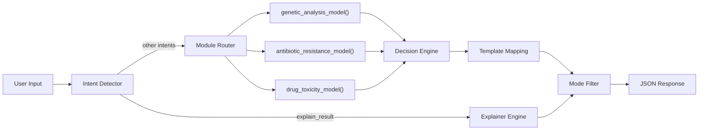

# TheraGenome AI — Core Chatbot Engine Walkthrough

## What Was Built

A production-ready backend module for the TheraGenome AI healthcare chatbot. The engine processes free-text user input through a 4-stage pipeline and returns **strictly structured JSON** — zero natural language sentences.

## Architecture



### Pipeline Stages

| Stage | File | Responsibility |
|-------|------|---------------|
| 1. Intent Detection | [intent_detector.py](file:///c:/Stuff/VSC/Repos/cmrit/chatbot/backend/chatbot/intent_detector.py) | Regex-based classifier with confidence scoring. Supports 6 intents. Drop-in replaceable with ML model. |
| 2. Bypass: Explainer | [explainer.py](file:///c:/Stuff/VSC/Repos/cmrit/chatbot/backend/chatbot/explainer.py) | Provides structured rationale exclusively by analyzing previous contexts (`last_response`). No model recomputation. |
| 3. Module Routing | [router.py](file:///c:/Stuff/VSC/Repos/cmrit/chatbot/backend/chatbot/router.py) | Dispatch table maps regular intents → model pipelines. Error-isolated per model. |
| 4. Decision Engine | [decision_engine.py](file:///c:/Stuff/VSC/Repos/cmrit/chatbot/backend/chatbot/decision_engine.py) | Risk escalation matrix, confidence scoring with penalties, reason codes. Selects response template. |
| 5. Mode Filtering | [mode_filter.py](file:///c:/Stuff/VSC/Repos/cmrit/chatbot/backend/chatbot/mode_filter.py) | Controls level of detail based on Doctor vs Patient modes. |
| 6. Response Formatting | [templates.py](file:///c:/Stuff/VSC/Repos/cmrit/chatbot/backend/chatbot/templates.py) | Enum-based template codes + builder. No natural language allowed. |

---

## File Structure

```
backend/
├── __init__.py
├── main.py                      ← FastAPI app + CLI demo
├── chatbot/
│   ├── __init__.py
│   ├── intent_detector.py       ← Intent classification (6 intents)
│   ├── explainer.py             ← Context-driven explanation logic
│   ├── router.py                ← Model dispatch + orchestration
│   ├── decision_engine.py       ← Risk/confidence/template selection
│   ├── mode_filter.py           ← Filters data strictly by current mode
│   ├── templates.py             ← Response template codes
│   └── controller.py            ← Wires everything + FastAPI route
├── models/
│   ├── __init__.py
│   ├── genetic.py               ← Pharmacogenomic analysis simulator
│   ├── resistance.py            ← Antibiotic resistance profiling
│   └── toxicity.py              ← Drug toxicity screening
└── tests/
    ├── __init__.py
    └── test_chatbot.py           ← 20 tests (all passing)
```

---

## API

### `POST /api/v1/chatbot/query`

**Request:**
```json
{
  "input": "Analyse the toxicity of amoxicillin",
  "mode": "doctor",
  "context": { "drug": "amoxicillin" }
}
```

**Response:**
```json
{
  "intent": "drug_analysis",
  "template": "DRUG_USE_WITH_CAUTION",
  "variables": {
    "drug_name": "amoxicillin",
    "risk_level": "medium",
    "recommended_drug": "amoxicillin",
    "confidence_score": 0.67,
    "reason_codes": ["moderate_toxicity_risk", "contraindications_present"]
  },
  "data": { "toxicity_analysis": { ... }, "therapy_decision": { ... } },
  "metadata": { "mode": "doctor", "processing_time_ms": 0.15 }
}
```

### Mode Behavior
- **`doctor`** — Full model outputs in `data`
- **`patient`** — Only the decision summary in `data`, raw model data stripped

---

## Supported Intents

| Intent | Triggers | Models Invoked |
|--------|----------|---------------|
| `input_genetic_data` | "genetic data", "DNA", "genome", "CYP2D6" | `genetic_analysis_model` |
| `input_infection_data` | "infection", "MRSA", "bacteria", "culture result" | `antibiotic_resistance_model` |
| `drug_analysis` | "drug", "toxicity", "side effect", "dosage" | `drug_toxicity_model` + optionally `genetic_analysis_model` |
| `compare_drugs` | "compare", "vs", "which is better" | `drug_toxicity_model` × N drugs |
| `explain_result` | "explain", "what does this mean", "interpret" | `explanation_resolver` |
| `general_query` | (fallback) | `fallback_handler` |

---

## Response Templates

| Template Code | When Used |
|---------------|-----------|
| `SAFE_TO_USE` | Risk = low |
| `DRUG_USE_WITH_CAUTION` | Risk = medium |
| `DRUG_NOT_RECOMMENDED` | Risk = high |
| `GENETIC_DATA_RECEIVED` | Genetic data processed |
| `INFECTION_DATA_RECEIVED` | Infection data processed |
| `COMPARISON_RESULT` | Drug comparison complete |
| `EXPLANATION_PROVIDED` | Result explanation ready |
| `REQUIRE_MORE_DATA` | Missing required context |
| `UNSUPPORTED_QUERY` | Unrecognized request |
| `MODEL_ERROR` | Model execution failure |
| `GENERAL_RESPONSE` | Catchall fallback |

---

## Decision Engine Logic

The decision engine uses a **risk escalation matrix**:

```
combined_risk = max(toxicity_risk, genetic_risk)
```

Confidence starts at `0.92` and is penalized:
- High toxicity → -0.25
- Medium toxicity → -0.10
- Adverse genetic profile → -0.20
- Contraindications present → -0.15

If `risk_level == "high"`, the drug is **not recommended** (`recommended_drug = null`).

---

## Testing

**16 tests — all passing** ✅

```
TestDrugAnalysis::test_intent_detected                 PASSED
TestDrugAnalysis::test_full_pipeline_doctor_mode       PASSED
TestDrugAnalysis::test_full_pipeline_patient_mode      PASSED
TestDrugAnalysis::test_confidence_score_range          PASSED
TestDrugAnalysis::test_reason_codes_present            PASSED
TestCompareDrugs::test_intent_detected                 PASSED
TestCompareDrugs::test_comparison_result               PASSED
TestCompareDrugs::test_comparison_patient_mode         PASSED
TestMissingData::test_compare_without_drugs            PASSED
TestMissingData::test_explain_without_reference        PASSED
TestMissingData::test_empty_input                      PASSED
TestMissingData::test_unknown_query                    PASSED
TestEdgeCases::test_genetic_data_intent                PASSED
TestEdgeCases::test_infection_data_intent              PASSED
TestEdgeCases::test_metadata_always_present            PASSED
TestEdgeCases::test_no_natural_language_in_response    PASSED
```

Run with: `python -m pytest backend/tests/test_chatbot.py -v`

---

## How to Run

```bash
# Install dependencies
pip install -r requirements.txt

# Option 1: FastAPI server
uvicorn backend.main:app --reload --port 8000

# Option 2: CLI demo (no FastAPI needed)
python -m backend.main

# Run tests
python -m pytest backend/tests/ -v
```

---

## Integration Points

The module is designed for downstream integration:

- **Multilingual layer** → Consume `template` + `variables`, render in any language
- **Real ML models** → Replace mock functions in `backend/models/`, keep same return types
- **Frontend** → Hit `POST /api/v1/chatbot/query`, parse the structured JSON envelope
- **Audit logging** → Hook into `metadata.processing_time_ms` and `metadata.models_invoked`
